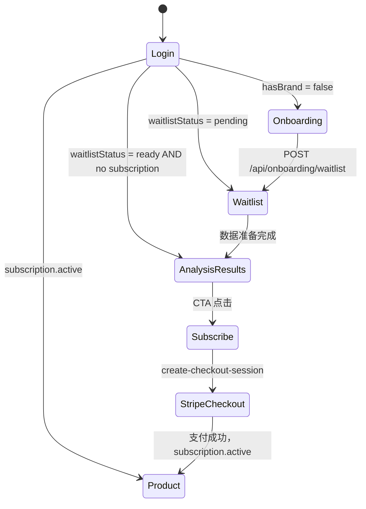

# Waitlist → 分析报告 → 订阅 → 正式产品流程 API 文档

本文件梳理用户从注册登录、进入等待名单、收到分析报告、选择订阅计划、完成支付并进入正式产品的全流程接口需求，方便前后端以及数据团队协作。

## 流程概览

1. **注册 / 登录**  
2. **提交品牌/产品信息，进入 Waitlist**  
3. **（后台收集/生成数据）**  
4. **再次登录：识别账号 → 判断是否可查看分析报告**  
5. **查看分析报告概览（Standalone 页面）**  
6. **跳转订阅页 → 选择套餐 → Stripe 支付 / 开启试用**  
7. **支付成功 → 回写订阅信息 → 重定向到主产品（Overview）**

下文按步骤列出所需 API。

---

## 1. 注册 / 登录 API

| 动作 | API | 请求 / 响应 | 说明 |
|------|-----|-------------|------|
| 注册 | `POST /api/auth/signup` | `{ email, password }` → `{ token }` | 返回 JWT；前端保存后调用 `GET /api/auth/session`。 |
| 登录 | `POST /api/auth/login` | `{ email, password }` → `{ token, isNew }` | `isNew` 用于判断是否立即进入 Onboarding。 |
| 获取会话 | `GET /api/auth/session` | Header: `Authorization: Bearer ${token}` → `{ profile: { id, email, hasBrand, hasProduct, waitlistStatus, subscription? } }` | 根据 `hasBrand`/`waitlistStatus` 判断下一步路由。 |
| 登出 | `POST /api/auth/logout` | `{}` | 清除会话。 |

### 关键字段
- `profile.hasBrand`: 是否已经提交品牌/产品。  
- `profile.waitlistStatus`: `pending` / `ready` / `converted`。  
- `profile.subscription`: `{ planId, status, trialEndsAt }`，为后续判断订阅状态。  

---

## 2. Waitlist 提交（Onboarding）

| 步骤 | API | 请求 / 响应 | 说明 |
|------|-----|-------------|------|
| 创建品牌 | `POST /api/brands` | `{ name }` → `{ brand }` | 可与产品创建合并。 |
| 创建产品 | `POST /api/brands/:brandId/products` | `{ name, category? }` → `{ product }` | |
| 加入等待名单 | `POST /api/onboarding/waitlist` | `{ brandName, productName }` → `{ ok: true }` | 同时可记录更多字段：行业、目标市场等。 |

> 建议后端在 Waitlist API 中写入一条记录，包含：用户 ID、品牌、产品、提交时间、预估准备完成时间等。

---

## 3. 数据准备阶段

此阶段由后台或数据团队离线处理，不一定有对外 API，但可考虑：

| API / 服务 | 作用 |
|------------|------|
| `POST /internal/waitlist/:id/ready` | 数据准备完毕后调用，设置 `waitlistStatus = "ready"`，并可触发邮件通知。 |
| `GET /api/analysis/:userId` | 检查是否有可用的分析报告数据（JSON 数据源 / AI 生成结果）。 |

---

## 4. 再次登录 → 判断是否进入分析报告

前端登录后通过 `GET /api/auth/session` 获取 `waitlistStatus`、`subscription` 等信息，并据此路由：

| 状态 | 路由 | 说明 |
|------|------|------|
| `hasBrand=false` | `/onboarding/brand` | 继续填写品牌/产品信息。 |
| `waitlistStatus="pending"` | `/waitlist` | 显示“等待中”页面。 |
| `waitlistStatus="ready"` 且 `subscription` 为空 | `/analysis-results`（Standalone） | 可查看分析概览并提示升级。 |
| `subscription.status="active"` | `/overview`（主应用） | 已订阅，直接进入产品。 |

若需要更细判断，可加一个 API：
`GET /api/waitlist/status` → `{ status, estimatedReadyAt }`。

---

## 5. 分析报告概览页面（Standalone）

| 数据 | 来源 API | 说明 |
|------|----------|------|
| 分析 KPI（品牌影响力、排名、可见度、情绪、核心 Query 数、模型运行状态） | `GET /api/analysis/summary` 或复用 `/api/overview`/`/api/visibility`/`/api/sentiment`（只展示自有品牌） | 若数据来自静态 JSON，可直接使用 `/api/overview?productId=...`。 |
| CTA “成为 AI 搜索中的领先品牌” | 无（前端按钮） | 点击后跳转订阅选择页面。 |

> 在 Mock 阶段，可直接在 `/analysis-results` 调用 `/api/overview` 等接口并只显示自品牌数据。

---

## 6. 订阅选择 → Stripe

### 6.1 获取当前订阅
`GET /api/plan/current` → `{ plan: { id, status, startDate, endDate, remainingDays, isTrial } }`
用于显示“当前订阅”卡片（Trial/Active/Expired）。

### 6.2 选择套餐
组合以下 API：
1. `POST /api/stripe/create-checkout-session`（或 `/api/plan/activate`）  
   请求示例：
   ```json
   {
     "planId": "advanced",
     "priceId": "price_advanced_monthly",
     "successUrl": "https://app/subscribe/success",
     "cancelUrl": "https://app/subscribe"
   }
   ```
   响应：`{ checkoutUrl }`（真实模式）或 `{ ok: true }`（Mock）。

2. 支付成功后，Stripe Webhook/回调应调用内部接口以：
   - 创建/更新 Subscription 记录  
   - 设置 `profile.subscription = { planId, status: "active", trialEndsAt }`  
   - 将 `waitlistStatus` 置为 `"converted"`  
   - 可选：发送“试用开始”的邮件。

3. `POST /api/stripe/create-portal-session`：用于“管理订阅”/“取消订阅”按钮。

4. `GET /api/stripe/invoices`：用于账单历史。

---

## 7. 支付完成 → 跳转正式产品

支付成功后，前端应：
1. 调用 `GET /api/plan/current` 或 `GET /api/auth/session`，确认订阅状态变为 `active`。  
2. 一旦确认，重定向到 `/overview`（主应用）。  
3. `usePlanStore` / `useAuthStore` 需同步更新产品数量等限制。

若 Stripe 处于 Mock 模式，可在 `POST /api/plan/activate` 中直接返回成功并写入 session。

---

## 状态机总结



---

## 需要后端支持的关键信息

- `profile.waitlistStatus`、`profile.subscription` 在 `GET /api/auth/session` 中同步更新。  
- Waitlist → Ready 的切换可由内部任务或手动接口触发。  
- Stripe 支付成功后必须更新用户订阅状态（最好通过 Webhook）。  
- 建议在用户首次进入 `/analysis-results` 时记录一次日志，方便追踪转化漏斗。

---

如需进一步细化（例如补充邮件通知、Webhook 触发、内部数据处理接口等），可以在本文件基础上继续扩展章节。 |

